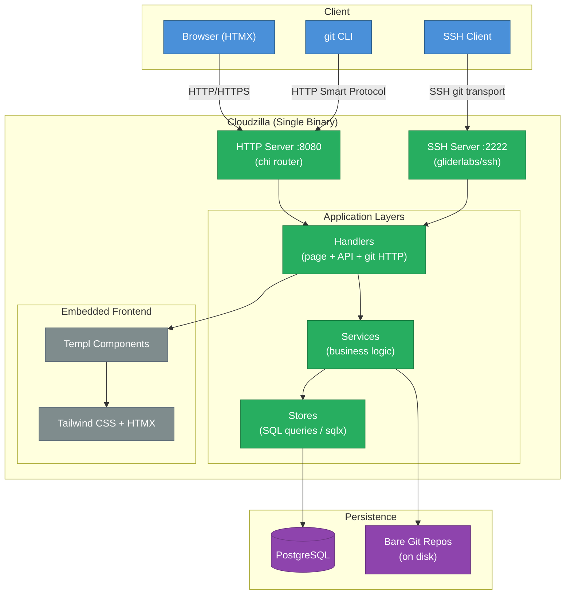

# Cloudzilla

A minimal, self-hosted Git forge — single binary, no external runtime dependencies.

**Stack:** Go · Templ · HTMX · Tailwind CSS · PostgreSQL

[](LICENSE)

> **Alpha**: Cloudzilla is under active development. APIs and features may change. Not recommended for production use yet.

---

## Milestones

| Milestone                                       | Scope                                                                                                                           | Status       |
| ----------------------------------------------- | ------------------------------------------------------------------------------------------------------------------------------- | ------------ |
| **M1 — Core Platform** (Phases 0–15.3)          | Identity, git hosting, issues, PRs, code review, orgs, wikis, discussions, gists, search, and 50+ features across 53 migrations | **Complete** |
| **M2 — Advanced Infrastructure** (Phases 16–20) | Container registry, Git LFS, CI/CD pipelines, clustering, GraphQL API                                                           | Planned      |

---

## Architecture



---

## Features

- **Git hosting**: HTTP + SSH smart protocol, branch/tag management, code browser with blame, commit history and diffs, clone URLs
- **Pull requests**: fast-forward / merge / squash strategies, diff view, draft PRs, auto-merge, conflict detection
- **Code review**: PR reviews (approve/request changes), inline line comments, code review suggestions with one-click apply, CODEOWNERS auto-assign
- **Issues**: open/close workflow, labels, assignees, milestones, pinning, locking, private issues, issue templates
- **Organizations**: shared namespaces with owner/member roles, org profile pages, member management
- **Access control**: three-tier permissions (instance/org/repo), branch protection rules, deploy keys, personal access tokens
- **Authentication**: JWT cookies, Google OAuth, TOTP 2FA with recovery codes, LDAP/SAML SSO, invitation system
- **Collaboration**: wikis, discussions, gists, profile READMEs, repository topics, stars, forks, reactions, @mentions, saved replies
- **Notifications**: in-app notifications with unread badge, email notifications (SMTP), watching/subscriptions
- **Webhooks**: push/issues/PR events, HMAC-SHA256 signing, retry with backoff, event filtering, delivery logs
- **Search**: full-text search across repos, issues, PRs, and users (PostgreSQL tsvector + GIN); advanced code search
- **Project management**: Kanban boards, milestones with progress tracking, activity feed
- **Infrastructure**: releases with tags, commit status API, audit log, OAuth apps, repository archive/templates, soft-delete/recovery, explore/trending, dependency graph
- **Admin**: first-run setup wizard, site settings, invitation management, superadmin controls

---

## Quick Start

### Docker (recommended)

```bash
make docker-build
make docker-run

# Run migrations
docker exec -it cloudzilla-cloudzilla-1 /app/cloudzilla-cli migrate

# Open http://localhost:8080 — redirects to /setup to create superadmin
```

All data persists in Docker named volumes (`cloudzilla_data`, `cloudzilla_pg_data`).
Set `CZ_AUTH_JWT_SECRET` in `docker-compose.yml` before exposing publicly.

```bash
make docker-down        # Stop and remove containers
```

---

### Local Development

**Prerequisites:** Go 1.23+, PostgreSQL 14+

```bash
go mod tidy
make setup-tailwind     # One-time: download Tailwind CLI
```

Copy and edit `config.yaml` with your database DSN, then:

```bash
make migrate            # Run DB migrations
make dev                # Backend + Tailwind watch on http://localhost:8080
```

First visit redirects to `/setup` to create your superadmin account.

---

## Documentation

| Document                                           | Description                                                 |
| -------------------------------------------------- | ----------------------------------------------------------- |
| [CLAUDE.md](./CLAUDE.md)                           | Developer guide: conventions, architecture, adding features |
| [docs/api-reference.md](./docs/api-reference.md)   | Full API endpoint tables with auth levels                   |
| [docs/configuration.md](./docs/configuration.md)   | Config reference, env vars, CLI, production deployment      |
| [docs/ROADMAP.md](./docs/ROADMAP.md)               | Full feature roadmap with phase specs and migration details |
| [docs/access-control.md](./docs/access-control.md) | Permission model: instance, org, and repo levels            |
| [docs/code-browser.md](./docs/code-browser.md)     | Code browser URL patterns, CodeService API, ref resolution  |
| [docs/deployment.md](./docs/deployment.md)         | Docker quick start, env var overrides                       |
| [docs/git-transport.md](./docs/git-transport.md)   | HTTP smart protocol, SSH auth, permission rules             |
| [docs/htmx-patterns.md](./docs/htmx-patterns.md)   | HTMX fragment rendering, template parse sequence            |
| [docs/notifications.md](./docs/notifications.md)   | Notification types, service API, extension pattern          |
| [docs/organizations.md](./docs/organizations.md)   | OrgService API, endpoints, role model                       |
| [docs/pr-merge.md](./docs/pr-merge.md)             | Merge strategies, conflict detection, PRDiffResult          |
| [docs/webhooks.md](./docs/webhooks.md)             | Webhook events, HMAC signing, dispatch pattern              |

---

## Make Targets

| Target                  | Description                                                |
| ----------------------- | ---------------------------------------------------------- |
| `make setup-tailwind`   | Download Tailwind CLI (one-time)                           |
| `make download-mermaid` | Download mermaid.min.js (one-time; auto-runs in build/dev) |
| `make build-css`        | Compile Tailwind CSS                                       |
| `make dev`              | Run backend + Tailwind watch concurrently                  |
| `make build`            | Build Go binaries (with embedded CSS)                      |
| `make migrate`          | Run DB migrations                                          |
| `make lint`             | Run golangci-lint                                          |
| `make test`             | Run Go tests                                               |
| `make docker-build`     | Build Docker image                                         |
| `make docker-run`       | Start with docker compose                                  |
| `make docker-down`      | Stop and remove containers                                 |

---

## Project Structure

```
cmd/
  server/            # HTTP server entrypoint
    frontend/        # Static files (embedded in binary)
      static/
        main.css     # Compiled Tailwind output
      htmx.min.js    # HTMX library
  cloudzilla/        # Admin CLI (cobra)
internal/
  config/            # Config loading (viper + YAML)
  db/                # DB connection + migration runner
  model/             # Data structs (db + json tags)
  store/             # Store layer (raw SQL via sqlx)
  service/           # Business logic (calls stores)
  handler/           # HTTP handlers (page + API + git)
  middleware/        # Auth, logger, CORS, RequireSetup
  router/            # chi route registration
  ssh/               # SSH server (gliderlabs/ssh)
  view/              # Templ components
    layout/          # Base layout component
    pages/           # Page components
    fragments/       # HTMX fragment components
migrations/          # SQL files (embedded via embed.FS)
tailwind/            # Tailwind CSS config
docs/                # Architecture and feature docs
```

---

## License

Cloudzilla is licensed under the [Business Source License 1.1](LICENSE).

See the [LICENSE](LICENSE) file for the full license text, including the change date and additional use grants.
